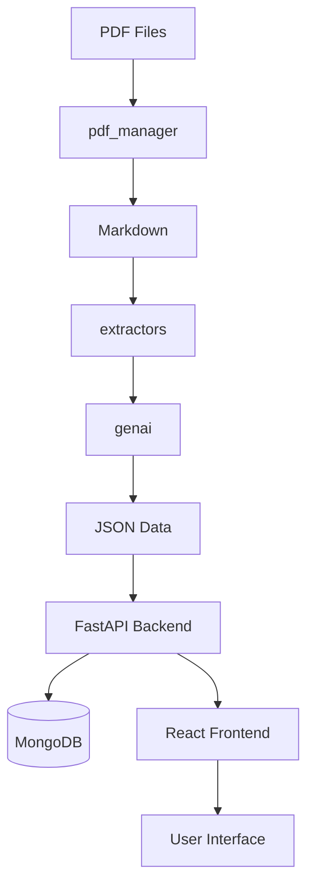
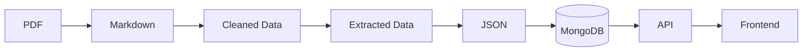

# System Patterns

## Architecture Overview

### Core Components
1. **Data Processing Layer**
   - **pdf_manager/**
     - PDF to markdown conversion
     - Markdown cleaning and standardization
   - **extractors/**
     - Data extraction using GenAI
     - Pydantic models for validation
     - Batch processing capabilities
   - **genai/**
     - Google GenAI integration
     - AI-powered data extraction

2. **Backend Layer**
   - FastAPI application
   - MongoDB integration with Motor
   - CRUD operation endpoints
   - Data validation with Pydantic
   - Async operation support

3. **Frontend Layer**
   - React with Vite
   - Routing system
   - API service integration
   - Patient data management interface
   - Data visualization components

### Key Design Patterns

1. **Three-Tier Architecture**
   - Data Processing: PDF → Markdown → Structured Data
   - Backend: FastAPI + MongoDB
   - Frontend: React + Vite

2. **Data Validation**
   - Pydantic models for type safety
   - AI-assisted data extraction
   - Schema validation at multiple levels

3. **Asynchronous Processing**
   - Async FastAPI endpoints
   - Motor for MongoDB operations
   - Batch processing capabilities

4. **Component-Based Frontend**
   - Modular React components
   - Reusable UI elements
   - Service-based API communication

## System Flow


## Data Flow


## CRUD Operations
```mermaid
graph TD
    FE[Frontend] --> Create[Create Patient]
    FE --> Read[Read Patient Data]
    FE --> Update[Update Patient]
    FE --> Delete[Delete Patient]
    Create --> API[FastAPI]
    Read --> API
    Update --> API
    Delete --> API
    API --> DB[(MongoDB)]
